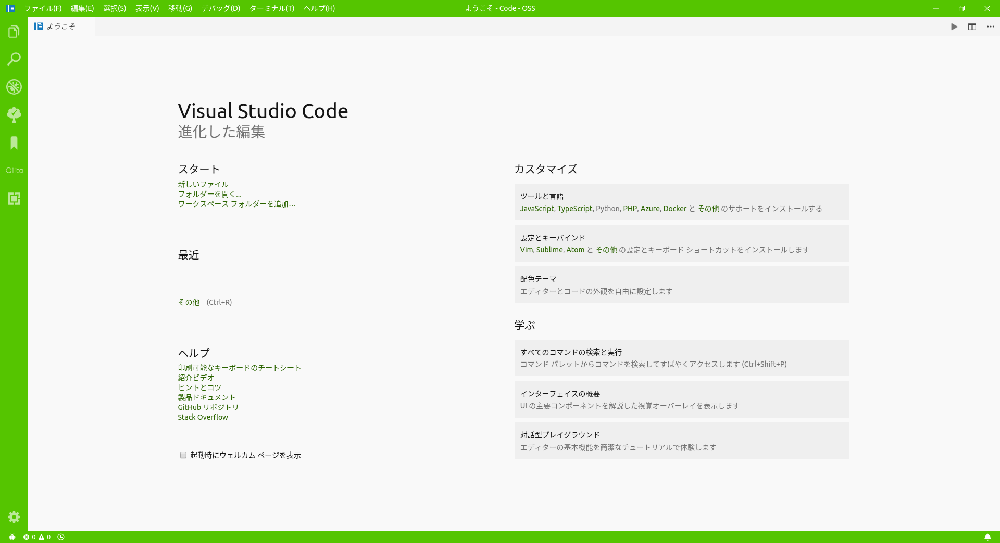
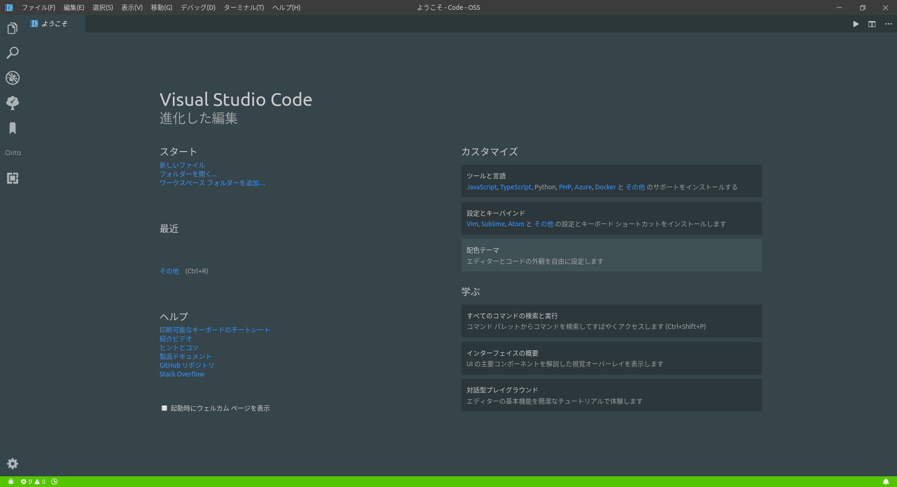

# Qiita Theme Pack for VS Code

A theme pack inspired by the colors of [Qiita](https://qiita.com/). Contains a light and dark variant of the theme.

## Themes

### **Qiita白** (Light Theme)

 - **UI:** `considered complete`
 - **Syntax Highlighting:** `mostly complete`

---

### **Qiita闇** (Dark Theme)

 - **UI:** `work in progress`
 - **Syntax Highlighting:** `work in progress`

## Installation

This plugin can't be found on the marketplace. Just copy the entire
directory into the Visual Studio Code extension directory and reload
the editor. The extension should be picked up.
